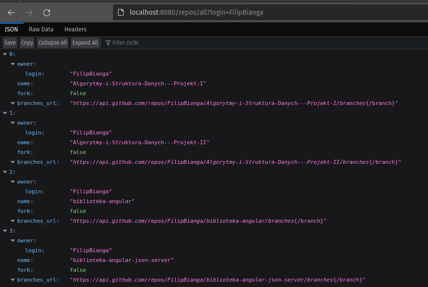

# GithubViewRepoOwnerLogin

Aplikacja w której podając nazwę użytkownika oraz nagłówek (header : "Accept: application/json") powinniśmy otrzymać w odpowiedzi: 
 
<strong> Nazwa repozytorium</strong>
 
<strong> Login właściciela </strong>
 
<strong> Dla każdej gałęzi jej nazwa i ostatni commit sha </strong>
 
 
Jezeli podany użytkownik nie istnieje w bazie Github powinniśmy otrzymać odpowiedz 404 w podanym niżej formacie:
 
 
{
 
 
"status": ${responseCode}
 
"message": ${whyHasItHappened}
 
 
}
 
 
Jeżeli odpowiedz w nagłówku xml zamiast json powinniśmy otrzymać kod 406 oraz format:
 
 
{
 
 
"status": ${responseCode}
 
"message": ${whyHasItHappened}
 
 
}

Wszelkie zapytania pod adresem lub w Postmanie:
 
http://localhost:8080/repos/all?login={nazwaUzytkownika}
 
Przykład
 
 
